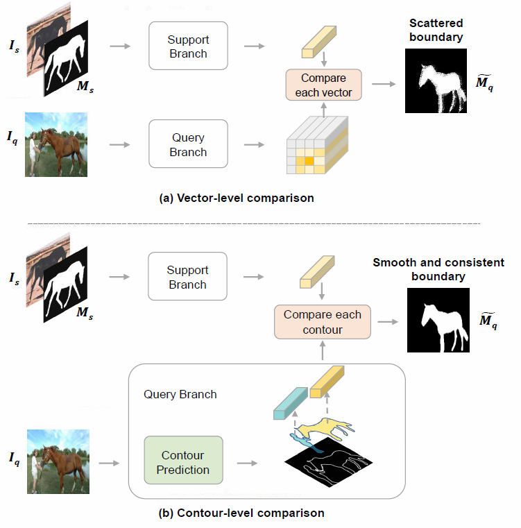

# CTANet
The code is for the paper "Rethinking and Improving Few-Shot Segmentation from a Contour-Aware Perspective" 

<p align="left">
  
</p>

## Overview
+ `COCO/` includes scripts for COCO-20<sup>i</sup> dataset
+ `FSS/` includes scripts for FSS-1000 dataset
+ `VOC/` includes scripts for Pascal-5<sup>i</sup> dataset

And for each folder:
+ `model/` includes related models and modules
+ `store/` includes pretrained models under 1-shot setting
+ `others/` includes script of loss functions 

## Get started
### Requirements
python == 3.9, torch == 1.9, numpy, einops, opencv-python

### Dataset
Related datasets Pascal-5<sup>i</sup> / COCO-20<sup>i</sup> / FSS-1000 can be found in [Google Driver](https://drive.google.com/drive/folders/1j7v5SXmqPfgQ6Jm_jSmIeYeClpvyiZzn?usp=sharing)

### Test and  Train
+ Specify the path of datasets in get_data.py
+ Specify the path of pre-trained models in the test file
+ Use the following command 
  ```
  python Test.py/train.py
  ```